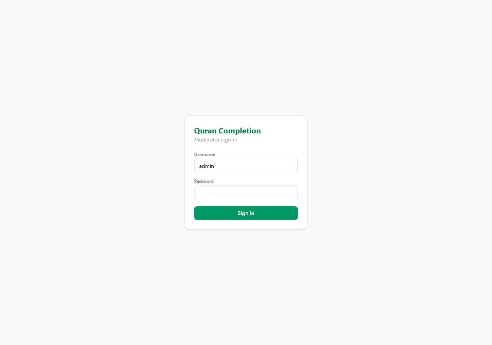
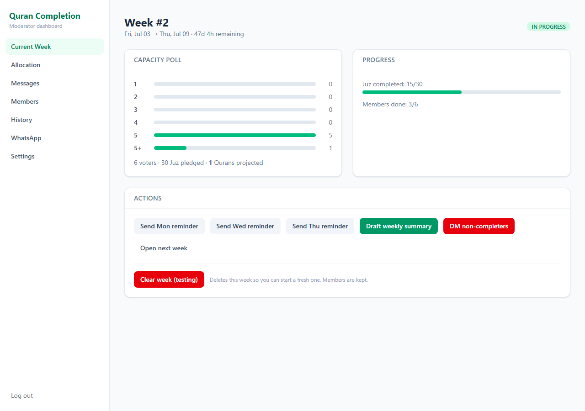
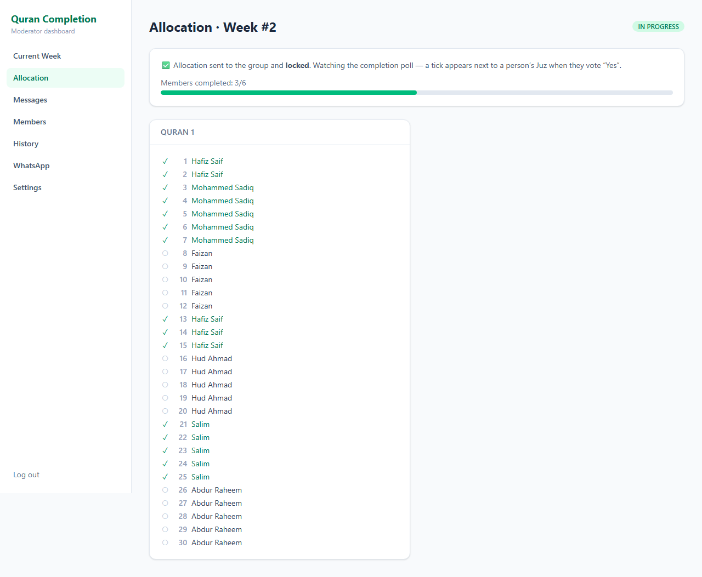
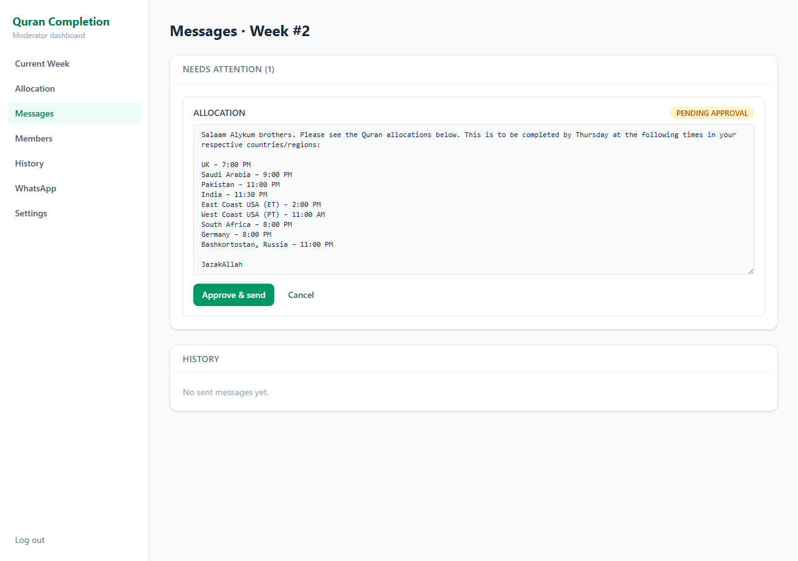
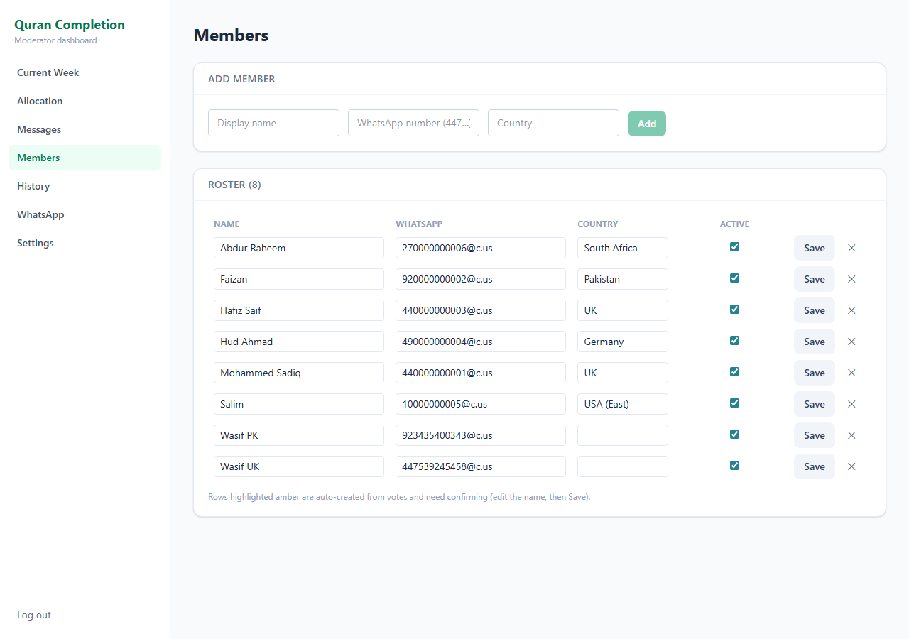
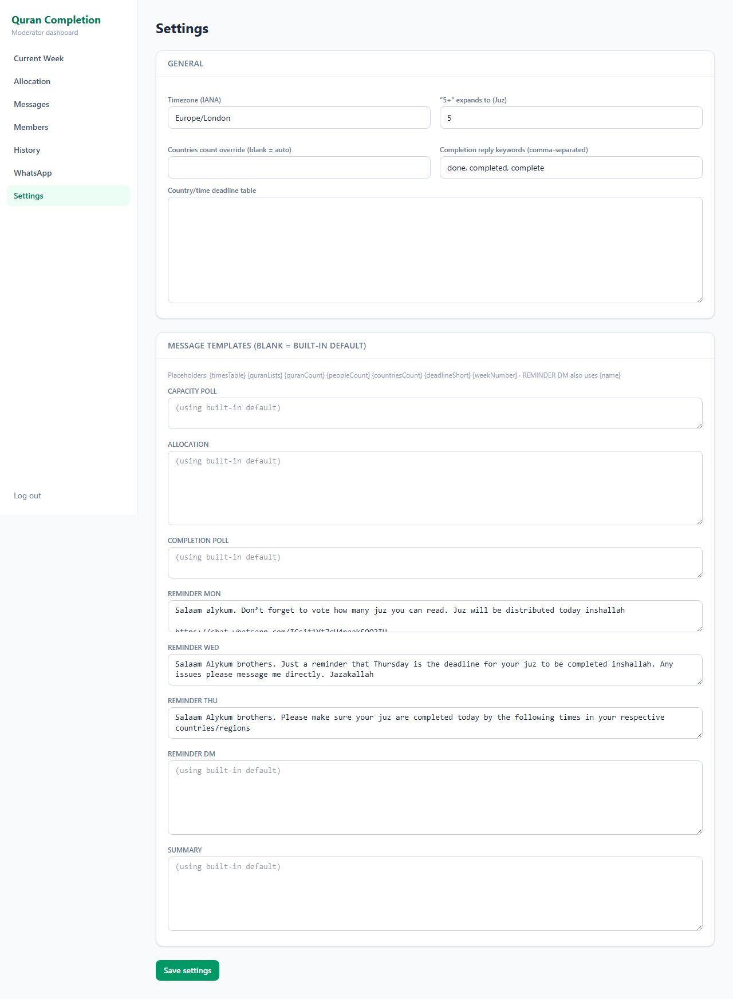
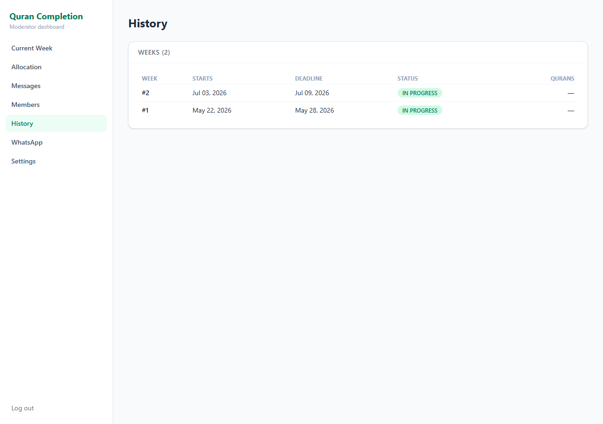

# Quran Completion Automation

A self-hosted system that automates a community's **weekly WhatsApp Quran-completion drive**. Each week, members pledge how many Juz (1/30th of the Qur'an) they'll read via a WhatsApp poll; the system auto-allocates specific Juz across however many complete Qurans the group can finish, posts the allocation list, tracks completion, sends reminders, and writes the closing summary — all from one moderator dashboard, while keeping the **existing WhatsApp group** as the channel.

The bot posts into the group like any member. A new **week starts every Friday**.

---

## Dashboard tour

> Screenshots use demo data (real allocations/voters are private).

### Sign in

A single moderator account (JWT). Every API route except the health check requires auth.



### Current week

The hub: live capacity-poll tally, projected number of Qurans, completion progress, deadline countdown, and the contextual actions for the week's current phase.



### Allocation

Auto-allocate Juz from the pledges (honouring PM'd requests), tweak by hand, then **Approve & send**. Once sent, the grid **locks** (read-only) and a **green tick appears in front of every Juz** as each person votes "Yes" on the completion poll — refreshing live.



### Messages (outbox)

Scheduled and sent messages. The two high-stakes messages — the allocation list and the weekly summary — wait here for one-click approval; everything else sends automatically.



### Members

The roster. Voters whose number the system can resolve are matched automatically; unknown voters appear as provisional members to confirm or rename once.



### Settings

Group selection, timezone, the country/time deadline table, the "5+" expansion value, completion-reply keywords, and fully editable message templates (including the private DM reminder).



### History

Every past week with its status and the number of Qurans completed.



---

## How the weekly cycle works

| When                                | What happens                                                                                                                                                                          | Mode         |
| ----------------------------------- | ------------------------------------------------------------------------------------------------------------------------------------------------------------------------------------- | ------------ |
| **Thu evening**                     | Capacity poll posted — _"How many Juz can you read next week?"_ (1 / 2 / 3 / 4 / 5 / 5+)                                                                                              | Auto         |
| Anytime                             | Members PM the moderator for specific Juz → moderator enters requests in the dashboard                                                                                                | Manual       |
| **Fri**                             | System auto-allocates Juz across the week's Qurans (honouring requests); moderator reviews the grid and **approves**; allocation list + completion poll are posted and the grid locks | **Approval** |
| **Mon / Wed / Thu**                 | Completion reminders posted to the group                                                                                                                                              | Auto         |
| **Thu afternoon**                   | A private DM reminder is sent to each member who still hasn't voted "Yes"                                                                                                             | Auto         |
| When all complete (or Thu deadline) | Weekly summary drafted — _"we completed N Qurans, M people, C countries"_                                                                                                             | **Approval** |

Vote tallies and completion ticks update live. Any missed poll vote can be fixed with a manual toggle, and a configurable group **"done" reply** also counts as completion.

---

## Features

- **Native WhatsApp polls** for capacity and completion, posted to the group.
- **Auto-allocation algorithm** — fills Juz 1–30 across N Qurans from the pledged counts, keeps each person's Juz contiguous where possible, and honours specific Juz requests. Pure & unit-tested.
- **Three completion signals**, reconciled per member: poll "Yes" (auto-read), a group "done" reply, and a manual dashboard toggle.
- **`@lid` → phone resolution** — WhatsApp delivers some group voters as linked-device IDs; the system resolves these to phone numbers and links them to your roster so real names show.
- **Mixed send policy** — reminders & polls auto-send; the allocation list & summary require one-click approval.
- **Timezone-aware scheduler** for the whole cycle, with idempotent, restart-safe jobs.
- **Editable templates** that reproduce the group's existing message wording.
- **Moderator dashboard** (React) with JWT auth.

---

## Architecture

```
web (React + Vite, served by nginx)  ──/api──▶  api (NestJS)
                                                  ├─ whatsapp-web.js client (the WhatsApp session, headless Chromium)
                                                  ├─ scheduler (cron: polls, reminders, DM nudge, summary)
                                                  ├─ domain (weeks, members, allocation, votes, outbox, templates)
                                                  └─ Prisma ──▶ PostgreSQL
```

- **`api/`** — NestJS + TypeScript. Embeds `whatsapp-web.js` directly (sends text & polls, ingests poll votes via the `vote_update` event), domain logic, cron scheduler, REST API. Prisma + PostgreSQL.
- **`web/`** — React + Vite + Tailwind + TanStack Query moderator dashboard.
- **`docker-compose.yml`** — `db` (Postgres 16), `api` (with system Chromium), `web` (nginx).

### Project structure

```
api/
  src/
    wa/          whatsapp-web.js client: QR, send text/poll, vote & message streams
    auth/        JWT login + global guard
    members/     roster CRUD, provisional/@lid resolution
    week/        weekly lifecycle state machine (Friday-anchored)
    capacity/    capacity votes + Juz requests + tally
    allocation/  pure allocation algorithm (+ tests) and persisted grid
    vote/        vote ingestion, completion, reconciliation
    template/    message templates & rendering
    outbox/      message records + send/approve
    cycle/       orchestration (open week, allocate, remind, DM, summarise) + cron
    settings/    singleton config
  prisma/        schema + migrations
web/
  src/pages/     Login, CurrentWeek, Allocation, Outbox, Members, History, Connection, Settings
```

---

## Prerequisites

- Docker + Docker Compose (for deployment), **or** Node.js ≥ 22 + pnpm + Postgres (for development).
- A **dedicated WhatsApp number** for the bot (see _WhatsApp reliability & safety_).

## Quick start (Docker)

```bash
cp .env.example .env        # then edit secrets: JWT_SECRET, ADMIN_PASSWORD, …
docker compose up --build -d
```

- Dashboard: <http://localhost:8080>
- API health: <http://localhost:8080/api/health>

### First-run checklist (in the dashboard)

1. **Log in** with `ADMIN_USERNAME` / `ADMIN_PASSWORD`.
2. **WhatsApp** page → scan the QR with the bot phone (Linked devices → Link a device).
3. Once connected, **Load groups** → **Use this group** on the Quran group.
4. **Settings** → confirm timezone, the country/time deadline table, and the "5+" value.
5. **Members** → add the roster (name + WhatsApp number + country). Voters the system can't match are added as provisional members to confirm later.
6. Done — the scheduler runs the cycle automatically, or you can drive each step from **Current Week**.

### Weekly operation

The scheduler posts the capacity poll (Thu), drafts the allocation (Fri), sends reminders (Mon/Wed/Thu), DMs non-completers (Thu), and drafts the summary (Thu). The **allocation list** and **weekly summary** wait in **Messages** for your approval; everything else sends on its own.

---

## Local development

```bash
pnpm install
docker compose up -d db                          # or your own Postgres
pnpm --filter api exec prisma migrate deploy      # apply migrations
pnpm dev                                          # api (:3000) + web (:5173)
```

The Vite dev server proxies `/api` to `http://localhost:3000`.

```bash
pnpm --filter api run build           # compile API
pnpm --filter api run test            # unit tests (allocation, timestamp parsing)
pnpm --filter api exec prisma studio  # browse the DB
pnpm --filter web run build           # build dashboard
```

---

## Configuration

All config is via environment variables — see [`.env.example`](.env.example).

| Variable                                      | Purpose                                                                      |
| --------------------------------------------- | ---------------------------------------------------------------------------- |
| `DATABASE_URL`                                | PostgreSQL connection string                                                 |
| `JWT_SECRET` / `JWT_EXPIRES_IN`               | Dashboard auth token signing                                                 |
| `ADMIN_USERNAME` / `ADMIN_PASSWORD`           | Single moderator login (`ADMIN_PASSWORD_HASH` for a precomputed bcrypt hash) |
| `APP_TIMEZONE`                                | IANA timezone for the scheduler & deadlines (e.g. `Europe/London`)           |
| `WA_SESSION_PATH`                             | Where the WhatsApp `LocalAuth` session is persisted (a Docker volume)        |
| `WA_WEB_VERSION` / `WA_WEB_VERSION_CACHE_URL` | (Advanced) pin a WhatsApp Web build for vote-decryption stability            |
| `PUPPETEER_EXECUTABLE_PATH`                   | Chromium path (set to system Chromium in the Docker image)                   |

Per-message templates, schedule overrides, the times table and keywords are edited in **Settings** (stored in the DB).

---

## REST API (selected)

All under `/api`; all require `Authorization: Bearer <token>` except `POST /auth/login` and `GET /health`.

```
POST   /auth/login                       → { token }
GET    /wa/status | /wa/qr | /wa/groups  WhatsApp session + group picker
GET    /weeks | /weeks/current           weeks; DELETE /weeks/:id (clear)
POST   /weeks/:id/transition             lifecycle transition
GET/PUT /weeks/:id/votes  /votes/tally   capacity votes
PUT    /weeks/:id/requests               PM'd Juz requests
GET    /weeks/:id/allocation             allocation grid; /generate; PUT /:allocId (reassign)
GET/PUT /weeks/:id/completion            completion tally + manual override
POST   /cycle/open-next-week             open week + post capacity poll
POST   /weeks/:id/prepare-allocation     auto-allocate + draft list
POST   /weeks/:id/approve-allocation     send list + completion poll (locks allocation)
POST   /weeks/:id/send-reminder          { type: REMINDER_MON|WED|THU }
POST   /weeks/:id/dm-non-completers      DM everyone who hasn't voted Yes (background)
POST   /weeks/:id/prepare-summary | /approve-summary
GET    /outbox                           message history; /:id/approve | /send | /cancel
GET/PUT /members  /members/:id           roster CRUD; /members/provisional
GET/PUT /settings
```

---

## WhatsApp reliability & safety

This uses `whatsapp-web.js`, an **unofficial** library that drives a real WhatsApp Web session.

1. **Use a dedicated number you can afford to lose.** The default policy is **group-only** posting — mass-DMing members is the main account-ban trigger. The one exception is the optional Thursday **DM-non-completers** nudge, which the moderator opts into explicitly; it sends sequentially with randomized 2–6s gaps to reduce risk.
2. **Poll-vote reading is best-effort.** Vote events can be missed — they fire only while the client is connected and aren't replayed. Mitigations: 24/7 auto-reconnect, stale-lock cleanup on restart, a vote audit log, the manual override, and the "done"-reply fallback. **Sanity-check tallies against the native WhatsApp poll before posting the summary.**
3. **`@lid` voters.** Some groups deliver voters as linked-device IDs rather than phone numbers; the system resolves them to phones (`getContactLidAndPhone`) and links them to roster members, falling back to a provisional "Unknown (number)" member when it can't.

---

## Developer / ops flags

- `WA_DISABLED=true` — don't start the WhatsApp client (no Chromium).
- `WA_FAKE_SEND=true` — (non-production) sends return synthetic IDs; with the `POST /api/wa/simulate-vote` / `simulate-message` dev endpoints the whole cycle is testable without a live session.
- `SCHEDULER_DISABLED=true` — disable cron jobs (manual triggers still work).

The dashboard also has a **"Clear week (testing)"** button to wipe the current week and start fresh.

---

## Status

Fully built and deployed; live WhatsApp session connected and verified end-to-end (capacity & completion votes auto-read, `@lid` resolution working). Built in phases: scaffold/Docker, WhatsApp connect, domain + allocation, vote ingestion, scheduler/outbox/templates, dashboard + auth — followed by the live hardening (timestamp & reconnect fixes, `@lid` resolution, allocation locking, Thursday DM nudge).

### Regenerating the screenshots

```bash
cd api && node scripts/screenshots.cjs   # seeds demo data, captures docs/screenshots/*, cleans up
```
